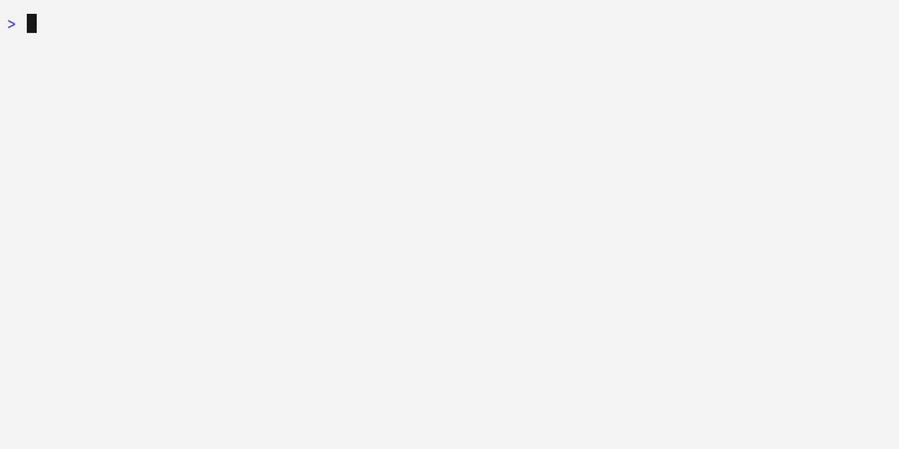

# ai-kit

[](https://github.com/clubmatto/vetrina/actions/workflows/ai-kit-ci.yml)
[](https://www.npmjs.com/package/@clubmatto/ai-kit)
[](/LICENSE)

The AI configuration CLI from Club Matto. Sync rules, skills, and commands to
power up your AI coding workflow.

<picture>
  <source media="(prefers-color-scheme: dark)" srcset="../assets/vhs/ai-kit/basic-dark.gif">
  
</picture>

## Table of Contents

- [Install](#install)
- [Quick Start](#quick-start)
- [Usage](#usage)
- [Options Reference](#options-reference)
- [Language Detection](#language-detection)
- [What's Installed](#whats-installed)
- [Commands Reference](#commands-reference)
- [Local Development](#local-development)
- [Release](#release)
- [License](#license)

## Install

```bash
npm install -g @clubmatto/ai-kit
```

Requires Node.js 18+.

## Quick Start

```bash
# Sync AI configuration to your project
ai-kit sync
```

That's it. AI Kit detects your project's languages and installs the right
rules, skills, and commands automatically.

```bash
# See what changed
ai-kit sync

# Example output:
#   ai-kit v0.0.9  The AI configuration CLI
#   from Club Matto
#
#     Syncing AI rules, skills, and commands to your project...
#
#     → Installing TypeScript rules
#       ✓ .agents/rules/typescript.md
#       ✓ .agents/rules/react.md
#     → Installing Go rules
#       ✓ .agents/rules/go.md
#
#     ✓ Done!
#     +5 added
```

## Usage

```bash
# Initialize or update AI configuration
ai-kit sync

# Skip installing opencode.json
ai-kit sync --skip-opencode

# Language detection & filtering
ai-kit sync --all-rules              # Install all language rules
ai-kit sync --languages=go,kotlin    # Install specific language rules
ai-kit sync --monorepo               # Force monorepo AGENTS.md template
ai-kit sync --single-repo            # Force single-repo AGENTS.md template
```

### Detected Languages

| Language                | Detection File                                             |
| ----------------------- | ---------------------------------------------------------- |
| TypeScript / JavaScript | `package.json`, `.ts` / `.js` files                        |
| Go                      | `go.mod`, `.go` files                                      |
| Kotlin                  | `build.gradle`, `build.gradle.kts`, `pom.xml`, `.kt` files |
| Spring Boot             | `application.properties` / `.yml` + Kotlin / Java files    |
| Generic                 | Fallback when nothing matches                              |

Multiple languages trigger monorepo mode (all rules + monorepo AGENTS.md).
Single language triggers single-repo mode (language-specific AGENTS.md).

## Options Reference

| Option                | Description                                        |
| --------------------- | -------------------------------------------------- |
| `--skip-opencode`     | Skip installing `opencode.json` to project root    |
| `--all-rules`         | Install all language rules regardless of detection |
| `--languages=<langs>` | Comma-separated language list (e.g. `go,kotlin`)   |
| `--monorepo`          | Force monorepo AGENTS.md template                  |
| `--single-repo`       | Force single-repo AGENTS.md template               |

## Language Detection

AI Kit scans your project directory for language signatures:

- **TypeScript / JavaScript**: Looks for `package.json` or `.ts` / `.js` files
- **Go**: Looks for `go.mod` or `.go` files
- **Kotlin**: Looks for `build.gradle`, `build.gradle.kts`, `pom.xml` or `.kt`
  files
- **Spring Boot**: Looks for `application.properties` / `.yml` plus Kotlin /
  Java files

If no languages are detected, AI Kit installs all available rules (monorepo
mode).

### Rule Files

Each detected language gets its own rule file. Rules are self-contained
markdown files under `.agents/rules/`.

### Ordered Setup

When multiple languages are detected, the setup follows a deterministic order:
rules for each language are installed in the order they were detected. The
AGENTS.md template adapts to monorepo or single-repo mode automatically.

## What's Installed

| Location          | Description                                 |
| ----------------- | ------------------------------------------- |
| `.agents/rules/`  | Language / framework rules (auto-detected)  |
| `.agents/skills/` | Reusable AI capabilities                    |
| `opencode.json`   | Opencode configuration (optional)           |
| `AGENTS.md`       | Agent instructions (monorepo / single-repo) |

### File Details

**Language Rules** (`.agents/rules/`):

| Rule File        | Description                                |
| ---------------- | ------------------------------------------ |
| `typescript.md`  | TypeScript conventions, project structure  |
| `go.md`          | Go conventions, project structure          |
| `kotlin.md`      | Kotlin conventions, project structure      |
| `spring-boot.md` | Spring Boot conventions, project structure |

**General Rules** (always installed):

| Rule File      | Description                                      |
| -------------- | ------------------------------------------------ |
| `plan-mode.md` | Plan mode: concise plans, no time estimates      |
| `unsure.md`    | When instructions are ambiguous, ask for clarity |
| `writing.md`   | Writing style: progressive disclosure, no dashes |

New rules are added over time. Run `ai-kit sync --all-rules` to install
everything available.

**Skills** (`.agents/skills/`):

| Skill File       | Description                                       |
| ---------------- | ------------------------------------------------- |
| `playwright-cli` | Playwright CLI integration for browser automation |

**Commands** (configured in `opencode.json`):

| Command     | Description                           |
| ----------- | ------------------------------------- |
| `commit`    | Generate conventional commit messages |
| `pr-review` | Review pull requests                  |
| `synth`     | Synthesize technical decisions        |

## Commands Reference

| Command       | Description                           |
| ------------- | ------------------------------------- |
| `ai-kit sync` | Initialize or update AI configuration |

## Local Development

```bash
# Build the CLI
npm run build

# Link for local testing
npm link

# Test in any directory
ai-kit sync
```

### Project Structure

```
ai-kit/
├── src/
│   ├── index.ts              # CLI entry point (commander setup)
│   ├── cmd/
│   │   └── sync.ts           # sync command implementation
│   ├── commands/             # Agent command definitions
│   │   ├── commit.md
│   │   ├── interview.md
│   │   └── synth.md
│   ├── detection/            # Language detection
│   │   ├── detect.ts
│   │   └── language-detectors.ts
│   ├── rules/                # Language rule files
│   │   ├── go.md
│   │   ├── typescript.md
│   │   ├── kotlin.md
│   │   └── spring-boot.md
│   ├── skills/               # Skill files
│   │   └── playwright-cli/
│   ├── agents/               # AGENTS.md templates
│   ├── logger.ts
│   ├── manifest.ts
│   ├── output.ts
│   ├── plan.ts
│   ├── reader.ts
│   └── template.ts
├── package.json
└── tsconfig.json
```

### Adding a Rule

1. Add a markdown file to `src/rules/<language>.md`
2. Add a corresponding detector in `src/detection/language-detectors.ts`
3. The rule becomes available via `ai-kit sync` for matching projects

### Adding a Command

1. Add a markdown file to `src/commands/<name>.md`
2. Run `ai-kit sync` — commands are automatically wired into `opencode.json`

## Release

```bash
# Bump version in package.json first
git add ai-kit/package.json
git commit -m "release: bump version to <version>"

# Create git tag and push both (tag triggers automated release)
git tag -a ai-kit/v<version> -m "v<version>"
git push origin main --follow-tags
```

## License

MIT — see [LICENSE](/LICENSE) for details.
