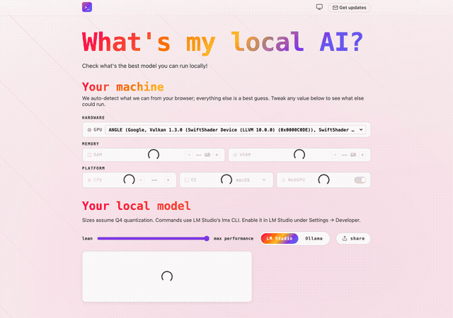

# whatsmylocalai

[](/LICENSE)

Which local AI can your machine run? Detects your hardware in the browser and
recommends models to run with [Ollama](https://ollama.com) or
[LM Studio](https://lmstudio.ai). All client-side, nothing leaves the browser.

<picture>
  <source media="(prefers-color-scheme: dark)" srcset="docs/demo-dark.gif">
  
</picture>

## Table of Contents

- [Quick Start](#quick-start)
- [How It Works](#how-it-works)
- [File Structure](#file-structure)
- [Development](#development)
- [Getting New Models](#getting-new-models)
- [Deploy](#deploy)
- [License](#license)

## Quick Start

```bash
npm install
npm run dev     # dev server at http://localhost:8080
npm run build   # production build → _site/
```

## How It Works

| Layer                | Source                                                                         | What it provides                                              |
| -------------------- | ------------------------------------------------------------------------------ | ------------------------------------------------------------- |
| What models exist?   | [`models.dev`](https://models.dev) via `@opencode-ai/models/snapshot`          | Canonical open-weights model list, capabilities, descriptions |
| Will it run?         | [`@auxot/model-registry`](https://www.npmjs.com/package/@auxot/model-registry) | Q4 VRAM estimates per model, parameter counts                 |
| Ollama tags + blurbs | `src/_data/enrichment.json` (curated by us, ~20 entries)                       | `ollama run` tags, human-readable blurbs                      |

Run commands come in two flavors, switchable in the UI (default: LM Studio,
persisted in localStorage):
`lms get https://huggingface.co/<huggingface_id>@<quant>`
is derived from registry data — no enrichment needed; `ollama run <tag>` uses
the enrichment table (falling back to a name slug).

At build time, Eleventy merges the three sources into a single JSON blob and
inlines it in the page. No network calls at runtime.

### Runtime Flow

1. **Passive detection** — GPU name via WebGL (`WEBGL_debug_renderer_info`), RAM
   via `navigator.deviceMemory`, CPU cores via `navigator.hardwareConcurrency`,
   OS from user agent.
2. **RAM cross-check** — `deviceMemory` is capped at 8 GB by Chromium, so on
   Apple Silicon the detected chip (from the WebGL renderer string) pins down
   the RAM configs that chip is actually sold with; we default to the smallest
   and show the candidates.
3. **VRAM estimation** — exact match against a GPU lookup table (confidence:
   high), ~70% of system RAM for Apple Silicon (confidence: medium), or a
   RAM-based guess (confidence: low).
4. **Recommendations** — `suggestModelsForVRAM` (from `@auxot/model-registry`)
   filters the 90+ Q4 models by VRAM. Best pick + also runs + beyond your
   machine. Simulate any machine — swap the GPU/OS in dropdowns, step
   RAM/VRAM/cores, flip WebGPU — and the picks update live.
5. **Corrections stick** — any tweak (GPU, RAM, VRAM, cores, OS, WebGPU) is
   saved to `localStorage` and reused on the next visit (a "reset my specs"
   button restores detection).

Everything runs client-side; nothing leaves the browser.

## File Structure

```
whatsmylocalai/
├── src/
│   ├── index.liquid           # page template
│   ├── credits.liquid         # credits page
│   ├── robots.txt.liquid      # robots.txt
│   ├── sitemap.xml.liquid     # sitemap
│   ├── _includes/             # head, header, footer
│   ├── _lib/
│   │   └── models-merge.js    # merge: snapshot + registry + enrichment
│   └── assets/
│       ├── css/               # main.css + page modules (imports the shared DS)
│       ├── js/
│       │   ├── app.ts         # Alpine component
│       │   ├── detect.ts      # hardware detection (pure)
│       │   └── models.ts      # filter/sort/group/run-cmd (pure)
│       └── og.png             # social card (scripts/og-image.mjs)
├── src/_data/
│   ├── enrichment.json        # ollama tags + blurbs
│   ├── gpu_database.json      # GPU VRAM lookup table
│   ├── apple_chips.json       # Apple chip → RAM configs it ships with
│   ├── models.js              # default-exports _lib/models-merge (only export!)
│   └── site.js                # url, name, description
├── scripts/
│   ├── build.ts               # postcss + esbuild pipeline (dev/prod)
│   ├── demo.mjs               # Playwright demo GIF capture
│   └── og-image.mjs           # Playwright og.png capture
├── docs/
│   ├── demo-light.gif          # README demo (light)
│   └── demo-dark.gif           # README demo (dark)
├── _site/                     # built output (generated)
├── eleventy.config.ts
├── package.json
└── README.md
```

CSS and JS are built by `scripts/build.ts` (same pattern as `website/`):
PostCSS resolves the `@import` graph — including the shared design system in
`../assets/css/design-system/` — and esbuild bundles/minifies. Production
assets are content-hashed and mapped through `_site/assets/manifest.json`
(the `asset` Liquid filter resolves logical names like `css/main.css`).

`app.ts` imports `suggestModelsForVRAM` from `@auxot/model-registry`; esbuild
aliases the package to its browser-safe query module at bundle time, so no
runtime files are copied from `node_modules`.

The shared 3-state theme toggle (light/dark/system) lives in
`../assets/js/theme.ts` and is bundled into `app.ts`.

## Development

| Command                  | Description                                |
| ------------------------ | ------------------------------------------ |
| `npm install`            | Install dependencies                       |
| `npm run dev`            | Start dev server with live reload          |
| `npm run build`          | Build production site (clean + full build) |
| `npm run clean`          | Remove `_site` directory                   |
| `npm run lint`           | Typecheck + prettier check                 |
| `npm run typecheck`      | `tsc --noEmit`                             |
| `npm run prettier:write` | Format all files                           |

### Regenerating the Demo GIF

```bash
npm run build
node scripts/demo.mjs
```

Requires [Playwright](https://playwright.dev) (installed as a dev dependency) to
capture the page, and [ffmpeg](https://ffmpeg.org) to convert the recording to a
GIF. The output is written to `docs/demo-light.gif` and `docs/demo-dark.gif`.

### Regenerating the Social Card

```bash
npm run build
node scripts/og-image.mjs
```

Screenshots the built homepage at 1200×630 and writes `src/assets/og.png`
(referenced by the `og:image`/`twitter:image` meta tags).

### Eleventy Config

The build is configured in `eleventy.config.ts`:

- Runs `scripts/build.ts` (CSS + JS) on `eleventy.before` and rebuilds the
  changed asset type on `eleventy.beforeWatch`
- Passthrough copies `og.png` and the shared Alpine.js build
- Registers `json` (HTML-safe JSON) and `asset` (manifest lookup) filters
- Exposes `apiBaseUrl` (`API_URL` env, defaults to `https://api.matto.club`)

## Getting New Models

When a new open-weights model is released:

1. Update the registry: `npm update @auxot/model-registry`
2. Update models.dev: `npm update @opencode-ai/models`
3. If it needs an ollama tag or blurb, add it to `src/_data/enrichment.json`
4. `npm run build`

Steps 1—2 are automatic — the data comes from community-maintained packages.

## Deploy

Production is served at **https://whatsmylocal.ai**.

```bash
npm run build   # production build → _site/
```

Deploy the contents of `_site/` to the hosting platform. The newsletter form
posts to `apiBaseUrl` (`API_URL` env var, defaults to `https://api.matto.club`),
so no per-deploy API config is needed unless the API moves.

## License

MIT — see [LICENSE](/LICENSE) for details.
