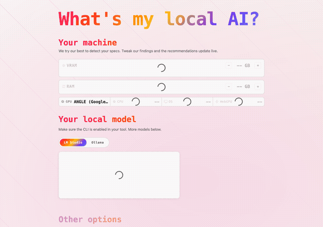

# whatsmylocalai

[](/LICENSE)

Which local AI can your machine run? Detects your hardware in the browser and
recommends models to run with [Ollama](https://ollama.com) or
[LM Studio](https://lmstudio.ai). All client-side, nothing leaves the browser.

<picture>
  <source media="(prefers-color-scheme: dark)" srcset="docs/demo.gif">
  
</picture>

## Table of Contents

- [Quick Start](#quick-start)
- [How It Works](#how-it-works)
- [File Structure](#file-structure)
- [Development](#development)
- [Getting New Models](#getting-new-models)
- [Deploy](#deploy)
- [License](#license)

## Quick Start

```bash
npm install
npm run dev     # dev server at http://localhost:8080
npm run build   # production build → _site/
```

## How It Works

| Layer                | Source                                                                         | What it provides                                              |
|----------------------|--------------------------------------------------------------------------------|---------------------------------------------------------------|
| What models exist?   | [`models.dev`](https://models.dev) via `@opencode-ai/models/snapshot`          | Canonical open-weights model list, capabilities, descriptions |
| Will it run?         | [`@auxot/model-registry`](https://www.npmjs.com/package/@auxot/model-registry) | Q4 VRAM estimates per model, parameter counts                 |
| Ollama tags + blurbs | `src/_data/enrichment.json` (curated by us, ~20 entries)                       | `ollama run` tags, human-readable blurbs                      |

Run commands come in two flavors, switchable in the UI (default: LM Studio,
persisted in localStorage):
`lms get https://huggingface.co/<huggingface_id>@<quant>`
is derived from registry data — no enrichment needed; `ollama run <tag>` uses
the enrichment table (falling back to a name slug).

At build time, Eleventy merges the three sources into a single JSON blob and
inlines it in the page. No network calls at runtime.

### Runtime Flow

1. **Passive detection** — GPU name via WebGL (`WEBGL_debug_renderer_info`), RAM
   via `navigator.deviceMemory`, CPU cores via `navigator.hardwareConcurrency`,
   OS from user agent.
2. **VRAM estimation** — exact match against a GPU lookup table (confidence:
   high), ~70% of system RAM for Apple Silicon (confidence: medium), or a
   RAM-based guess (confidence: low).
3. **Recommendations** — `suggestModelsForVRAM` (from `@auxot/model-registry`)
   filters the 90+ Q4 models by VRAM. Best pick + also runs + beyond your
   machine. All adjustable via live steppers.

Everything runs client-side; nothing leaves the browser.

## File Structure

```
whatsmylocalai/
├── src/
│   ├── index.liquid           # page template
│   ├── credits.liquid         # credits page
│   └── assets/
│       ├── styles.css         # design tokens
│       └── app.js             # detection + suggestion engine (ESM)
├── src/_data/
│   ├── enrichment.json        # ollama tags + blurbs
│   ├── gpu_database.json      # GPU VRAM lookup table
│   └── models.js              # merge: snapshot + registry + enrichment
├── scripts/
│   └── demo.mjs               # Playwright demo GIF capture
├── docs/
│   └── demo.gif               # README demo
├── _site/                     # built output (generated)
├── eleventy.config.ts
├── package.json
└── README.md
```

`app.js` imports `suggestModelsForVRAM` from
`@auxot/model-registry` via a relative import. Eleventy copies
`query.js` from node_modules at build time so the browser can resolve it
(`<script type="module">`).

## Development

| Command             | Description                                |
| ------------------- | ------------------------------------------ |
| `npm install`       | Install dependencies                       |
| `npm run dev`       | Start dev server with live reload          |
| `npm run build`     | Build production site (clean + full build) |
| `npm run clean`     | Remove `_site` directory                   |

### Regenerating the Demo GIF

```bash
npm run build
node scripts/demo.mjs
```

Requires [Playwright](https://playwright.dev) (installed as a dev dependency) to
capture the page, and [ffmpeg](https://ffmpeg.org) to convert the recording to a
GIF. The output is written to `docs/demo.gif`.

### Eleventy Config

The build is configured in `eleventy.config.ts`:

- Passthrough copies `styles.css`, `app.js`, and Alpine.js from assets
- Copies `query.js` from `@auxot/model-registry` into the output so the browser
  can resolve the ESM import
- Registers a `json` Liquid filter for inlining model data

## Getting New Models

When a new open-weights model is released:

1. Update the registry: `npm update @auxot/model-registry`
2. Update models.dev: `npm update @opencode-ai/models`
3. If it needs an ollama tag or blurb, add it to `src/_data/enrichment.json`
4. `npm run build`

Steps 1—2 are automatic — the data comes from community-maintained packages.

## License

MIT — see [LICENSE](/LICENSE) for details.
